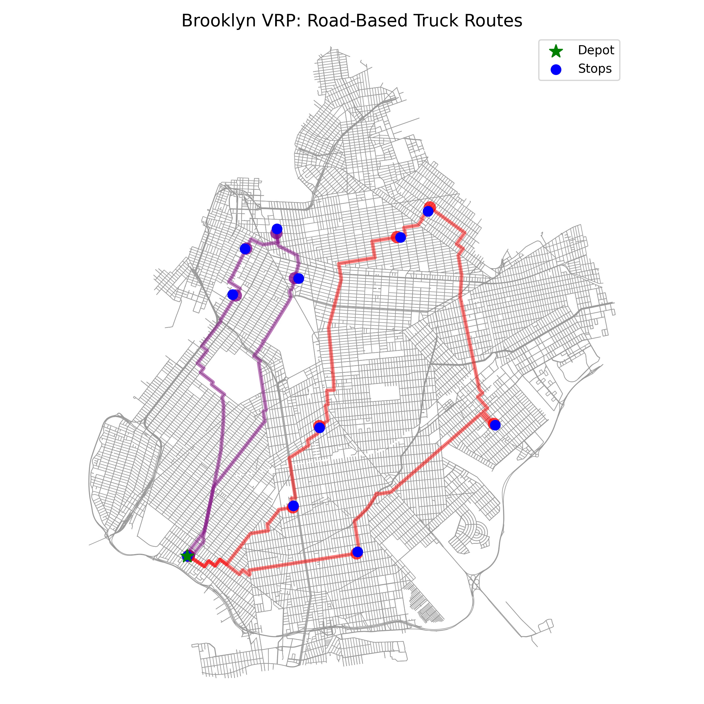

# Brooklyn Vehicle Routing Problem (VRP)

This project solves and visualizes a real-world Vehicle Routing Problem for Brooklyn, NYC.  
We use official NYC taxi zone data, optimize delivery routes with Google OR-Tools, and visualize them on actual Brooklyn streets using OSMNX.

---

## 📦 Files

- `nyc_delivery_routing.ipynb` — Main Python notebook (all code and explanation)
- `nyc_taxi_zone_centroid.csv` — Centroid locations for all NYC taxi zones
- `brooklyn_vrp_roads.png` — Static map image of the optimized truck routes

---

## 🚀 How to Run

1. Clone or download the repo.
2. Open `nyc_delivery_routing.ipynb` in Jupyter or Colab.
3. Install dependencies:
4. Run the notebook step by step.

---

## 🗺️ Example Output

---

## 🛠️ Tools Used

- **Google OR-Tools** (vehicle routing optimization)
- **OSMNX** (NYC road network and plotting)
- **GeoPandas**, **Pandas**, **Matplotlib**

---

## Data Sources

- [NYC TLC Taxi Zones](https://www.nyc.gov/site/tlc/about/tlc-trip-record-data.page)

---

**Made with ❤️**
